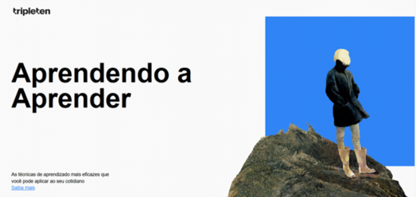
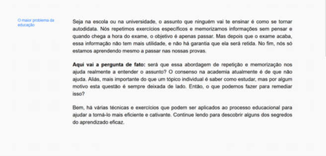
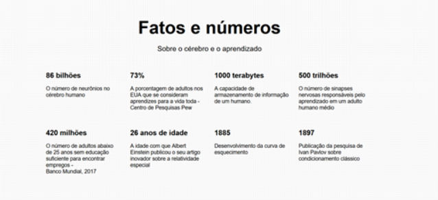
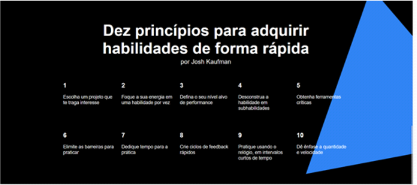

# Projeto: Web_aprendendo

<h1 align="center">

<a href="https://borges-camila.github.io/WEB_aprendendo/">Abrir aqui</a>

  
  
  
  
  
</h1>
 
- Projeto desenvolvido com o objetivo de elaborar um website, referente a um extra da Sprint 2 para por em prática novos conhecimentos.

## Tecnologias

- Projeto elaborado utilizando HTML e CSS;

## Ferramentas

    <a href="https://reactjs.org/" target="_blank" rel="noreferrer">

## Apredizados

- Melhor entendimento da estrutura do html.

## Melhorias

- Implementar a responsividade, para que o site se adapte a diferentes tamanhos de tela.
- Implementar mais interatividade com o usuário para tonar a experiência mais agradável.

## Como utilizar

- Você pode clonar o repositório
- Abrir o arquivo index.html
